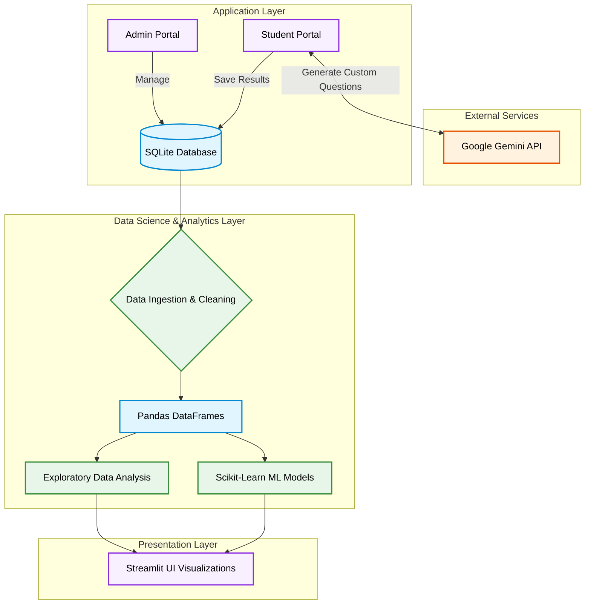

<div align="center">

# Learning Analytics Engine

**An intelligent student assessment platform that dynamically generates AI-driven exams, tracks user behavior telemetry, and performs statistical analysis and predictive modeling.**

[](https://www.python.org/)
[](https://aistudio.google.com/)
[](https://streamlit.io/)
[](https://pandas.pydata.org/)
[](https://scikit-learn.org/)
[](https://www.sqlite.org/)

</div>

---

## Overview

The **Learning Analytics Engine** is a comprehensive educational platform that merges real-time assessment delivery with advanced data science and machine learning capabilities. It allows students to take AI-generated, customized quizzes while administrators gain deep insights into cohort performance through interactive, predictive analytics. The platform leverages unsupervised K-Means clustering to segment learners, regression for score prediction, and Seaborn for rich exploratory data analysis.

---

### System Architecture



---

## Features

| Capability | Description |
|---|---|
| **Assessment Engine** | Secure platform supporting candidate registration, timed assessments, and performance tracking. Features detailed post-assessment feedback with correct answers and AI-generated explanations for mistakes. |
| **Dynamic Leaderboards** | Real-time, grouped hall of fame with explicit ranking. Filter top performers dynamically across specific Domains, Subjects, or Difficulty levels (Easy, Medium, Hard). |
| **AI-Powered Questions** | Dynamically generates custom, on-the-fly multiple-choice questions utilizing Google's Gemini Large Language Models, tailored to the user's selected difficulty. |
| **Personalized Analytics** | Students have access to a dedicated analytics tab showcasing their own personal seaborn charts (Score Distribution, Duration vs. Score, and Competency Breakdown). |
| **Granular Admin Insights** | Admins can view merged cohort statistics or use intuitive dropdowns to isolate and evaluate individual student performance interactively. |
| **Machine Learning** | Implements Binary Classification (Pass/Fail), Regression (Score Prediction), and K-Means Clustering (Learner Segmentation). |

---

## Tech Stack

- **Machine Learning & Analytics:** Scikit-Learn · Pandas · NumPy
- **Software Engineering:** Python · SQLite3 
- **LLM Integrations:** Google Gemini API
- **Visualizations:** Matplotlib · Seaborn · Streamlit
- **Environment:** Jupyter Notebooks · Git

---

## Directory Structure

```
Learning-Analytics-Engine/
│
├── app.py                              # Main Streamlit Web Application (Authentication & Routing)
├── pages/                              # Streamlit Multi-Page Components
│   ├── 1_Student_Portal.py             # Interactive Assessment Engine & Student Dashboard
│   └── 2_Admin_Portal.py               # Secure Admin Auth, User Management & Analytics
├── auth_utils.py                       # Secure Authentication & Password Hashing
├── db_utils.py                         # SQLite3 Database Connections & Schema Initialization
├── llm_utils.py                        # Gemini API Integrations for Content Generation
├── analytics.py                        # EDA & Descriptive Statistics Logic
├── ml_models.py                        # Scikit-learn Modeling Pipelines (Clustering, Regression)
│
├── Learning_Analytics_EDA.ipynb        # Comprehensive Jupyter Notebook for offline EDA
├── domains_catalog.json                # Pre-defined assessment domains & subjects catalog
├── telemetry.db                        # SQLite3 Database (Generated upon execution)
└── README.md                           # Project Documentation
```

---

## Setup and Installation

### Prerequisites

- Python 3.11+
- An active [Google Gemini API Key](https://aistudio.google.com/)

### 1. Clone the Repository

```bash
git clone https://github.com/Shashank17singh/Learning-Analytics-Engine.git
cd Learning-Analytics-Engine
```

### 2. Install Dependencies

```bash
pip install -r requirements.txt
```

### 3. Configure API Keys

The app requires an API key for generating AI-powered assessment questions. Create a `.streamlit/secrets.toml` file in the project root and add your Gemini API key:

```toml
GEMINI_API_KEY="your-gemini-api-key"
```
*(Alternatively, you can export `GEMINI_API_KEY` as an environment variable in your terminal).*

### 4. Launch the Dashboard

Once the dependencies are installed and the API key is configured, launch the Streamlit app:

```bash
streamlit run app.py
```

The app will open automatically in your browser at `http://localhost:8501`.

---

## Key Workflows

1. **Dynamic Content Generation:** Generates real-time, topic-specific assessments via the Gemini API based on student preferences (Domain, Subject, and Difficulty).
2. **Immediate Feedback Loop:** Submitting an assessment provides students with instant grading and transparent explanations for incorrect answers.
3. **End-to-End Tracking:** Student actions (time taken, accuracy, domain chosen) are captured in SQLite, rendered cleanly with standardized dates/times, and analyzed dynamically using Pandas.
4. **Statistical Rigor & Visualization:** Computes standard deviation, IQR, and Pearson correlation coefficients to identify conceptual bottlenecks. Visualized cleanly via Matplotlib and Seaborn for both students and admins.
5. **Predictive Modeling:** Trains Random Forest and Logistic Regression models on-the-fly to predict student success based on behavioral telemetry.

---

## Deployment

- **Dashboard URL:** [https://learning-analytics-engine.streamlit.app/](https://learning-analytics-engine.streamlit.app/)
