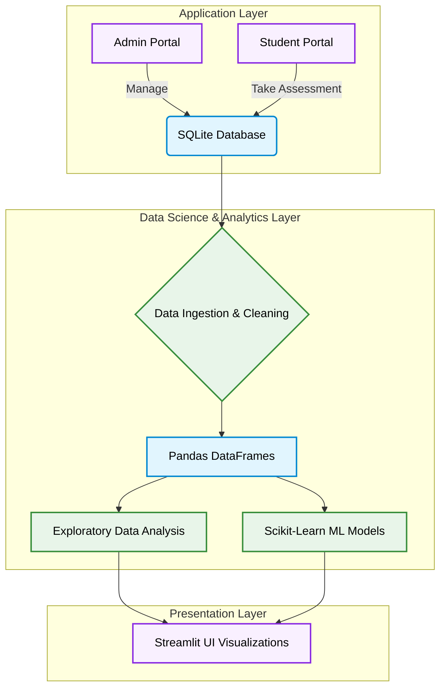

<div align="center">

# Quiz Management System

**An end-to-end Python assessment platform and Data Science Analytics dashboard for educational insights.**

[](https://www.python.org/)
[](https://streamlit.io/)
[](https://pandas.pydata.org/)
[](https://scikit-learn.org/)
[](https://www.sqlite.org/)

</div>

---

## Overview

Developed as a highly robust Data Science and Software Engineering portfolio project, this repository implements a dual-layer architecture. It features a fully operational assessment engine for conducting quizzes and a comprehensive analytics pipeline that transforms raw relational assessment logs into actionable pedagogical insights using Pandas, Scikit-learn, and Streamlit.

---

### System Architecture



## Features

| Capability | Description |
|---|---|
| **Assessment Engine** | A secure platform supporting candidate registration, timed quizzes, hints, and leaderboard rankings. |
| **Exploratory Data Analysis** | Automated descriptive statistics, competency segmentation, and statistical correlations (e.g., hints requested vs. final score). |
| **Machine Learning** | Implements Binary Classification (Pass/Fail), Regression (Score Prediction), and K-Means Clustering (Learner Segmentation). |
| **Interactive Dashboard** | Provides a modern, reactive interface to interact with real-time cohort analytics, histograms, and correlation heatmaps. |

---

## Tech Stack

**Machine Learning & Analytics** - Scikit-Learn · Pandas · NumPy
**Software Engineering** - Python · SQLite3 
**Visualizations** - Matplotlib · Seaborn · Streamlit
**Environment** - Jupyter Notebooks · Git

---

## Directory Structure

```
Quiz-Management-System/
│
├── app.py                              # Modern Streamlit Web Application (Main Web Dashboard)
├── main.py                             # Main CLI Entry Point & Menu Router
├── admin.py                            # Secure Admin Authentication & Role Management
├── quizmgmt.py                         # Quiz Question CRUD & Robust CSV Loader
├── quiz.py                             # Interactive Quiz Taking Engine (Timing & Hints)
├── leaderboard.py                      # Real-Time Ranked Leaderboard Module
├── analytics.py                        # EDA & Descriptive Statistics (Pandas, NumPy)
├── visualizer.py                       # Visual Dashboards & Charts (Matplotlib, Seaborn)
├── ml_models.py                        # Scikit-learn Modeling Pipelines
│
├── Quiz_Data_Science_Analysis.ipynb    # Complete Interactive Jupyter Notebook
├── quiz.csv                            # Bulk Question Bank (100+ Curated Questions)
├── qms.db                              # SQLite3 Database
└── README.md                           # You are here
```

---

## Setup and Installation

### Prerequisites

- Python 3.11+

### 1. Clone the Repository

```bash
git clone https://github.com/<YOUR_USERNAME>/Quiz-Management-System.git
cd Quiz-Management-System
```

### 2. Install Dependencies

```bash
pip install -r requirements.txt
```

### 3. Launch the Dashboard

Once the dependencies are installed, launch the Streamlit app to interact with the assessment engine and analytics platform.

```bash
streamlit run app.py
```

The app will open automatically in your browser at `http://localhost:8501`.

---

## Key Analytics Workflows

1. **End-to-End Tracking:** User actions (hints taken, time elapsed) are captured in SQLite and analyzed dynamically using Pandas and Seaborn.
2. **Statistical Rigor:** Computes standard deviation, IQR, and Pearson correlation coefficients to identify conceptual bottlenecks.
3. **Predictive Modeling:** Trains Random Forest and Logistic Regression models on-the-fly to predict student success based on behavioral telemetry.
